# Windows Attack Detection Lab

A hands-on Windows detection engineering lab using Sysmon and Splunk Enterprise.

This project demonstrates the process of collecting endpoint telemetry, identifying excessive logging noise, tuning Sysmon collection, generating benign attack-like activity, and investigating the resulting events in Splunk.

## Lab Environment

- Windows virtual machine
- Sysmon 15.21
- Splunk Enterprise
- PowerShell

## Project Objectives

- Configure Sysmon endpoint telemetry
- Ingest the Sysmon Operational event log into Splunk
- Measure and reduce noisy telemetry
- Detect PowerShell file creation activity
- Correlate related events using ProcessGuid
- Detect Windows Run-key persistence

## Telemetry Pipeline

**Windows activity → Sysmon → Windows Event Log → Splunk**

The Sysmon Operational event log was configured as a local Splunk input, allowing endpoint activity to be searched and investigated directly in Splunk.

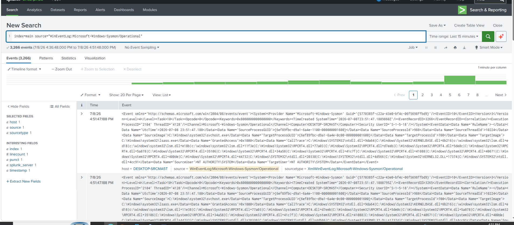

---

## Telemetry Tuning

The initial Sysmon configuration generated a large volume of telemetry. In a 15-minute window, the largest contributors included:

- Event ID 3: Network connections
- Event ID 5: Process termination
- Event ID 10: Process access

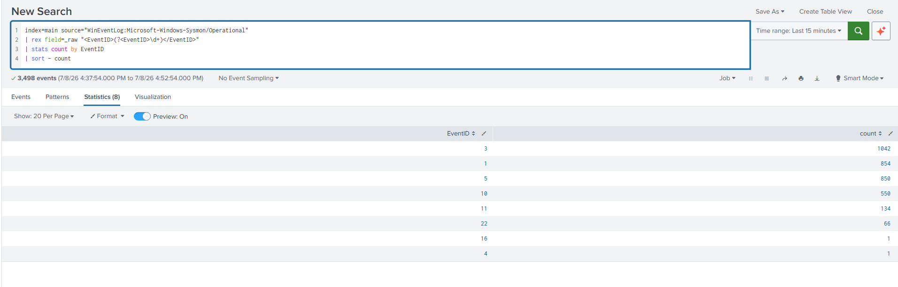

The configuration was tuned to reduce high-volume noise while retaining telemetry useful for the lab.

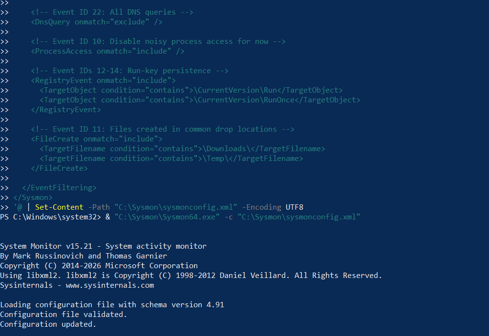

After tuning, the high-volume Event ID 5 and Event ID 10 activity was removed from the collected telemetry.

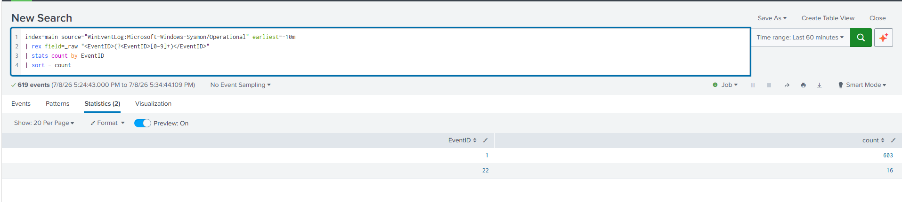

---

## Detection 1: PowerShell File Creation

A benign PowerShell command downloaded a test file into the user's Downloads directory.

The resulting Sysmon activity included:

- Event ID 22: DNS query
- Event ID 3: Network connection
- Event ID 11: File creation

The shared `ProcessGuid` was used to correlate activity from the same PowerShell process.

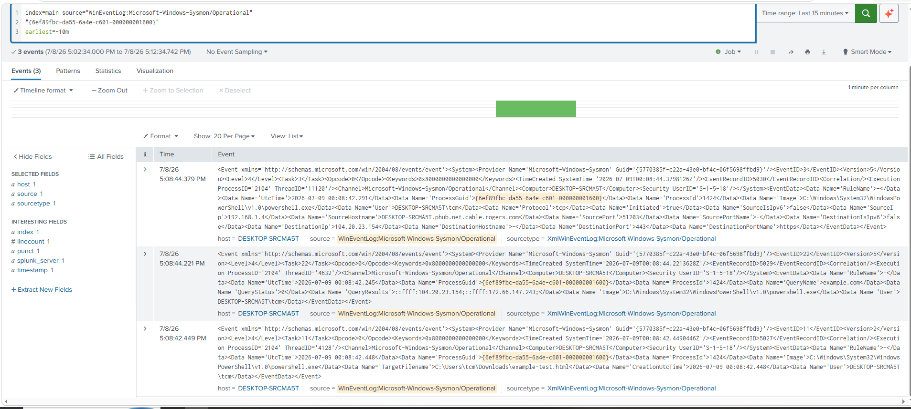

The raw Event ID 11 record showed `powershell.exe` creating the test file in the Downloads directory.

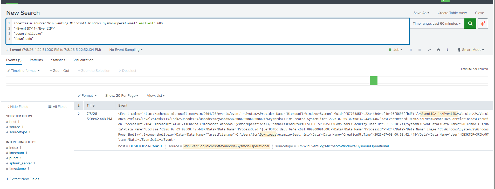

The raw XML was then converted into an analyst-friendly detection result containing the user, process image, target filename, and ProcessGuid.

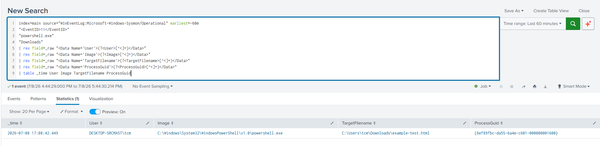

Detection query:

[`detections/powershell-download.spl`](detections/powershell-download.spl)

---

## Detection 2: Run-Key Persistence

A benign persistence mechanism was created by adding a registry value to:

`HKCU\Software\Microsoft\Windows\CurrentVersion\Run`

The value `LabPersistence` was configured to launch:

`C:\Windows\System32\notepad.exe`

Sysmon Event ID 13 captured the registry modification.

The important fields were:

- `Image`: the process that performed the modification
- `TargetObject`: the Run-key registry value
- `Details`: the program configured to execute at logon
- `ProcessGuid`: the identifier used to pivot into related process activity

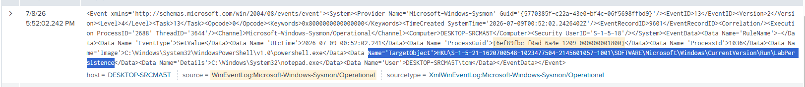

A ProcessGuid pivot was used to review related PowerShell activity and distinguish normal startup behavior from the actual persistence action.

Detection query:

[`detections/run-key-persistence.spl`](detections/run-key-persistence.spl)

---

## Project Files

- [`sysmonconfig.xml`](sysmonconfig.xml) — tuned Sysmon configuration used in the lab
- [`powershell-download.spl`](detections/powershell-download.spl) — PowerShell file creation detection
- [`run-key-persistence.spl`](detections/run-key-persistence.spl) — Run-key persistence detection

## Key Takeaways

- High-volume telemetry is not automatically useful telemetry.
- Sysmon collection should be tuned based on observed event volume.
- `ProcessGuid` provides a reliable way to correlate activity from the same process instance.
- Raw telemetry can be transformed into cleaner, analyst-friendly detection results.
- Parent processes, hashes, registry targets, and surrounding activity provide important investigative context.
- A legitimate binary such as PowerShell can still perform security-relevant actions, so behavior and context matter more than the executable name alone.

## Detection #3 — Suspicious PowerShell Command Execution

### Objective

Detect suspicious PowerShell execution using Sysmon Event ID 1 process creation telemetry. The detection focuses on command-line arguments commonly associated with suspicious or evasive PowerShell activity, particularly `ExecutionPolicy Bypass`.

### Test Activity

A safe PowerShell command was executed from a standard Command Prompt:

```cmd
powershell.exe -NoProfile -ExecutionPolicy Bypass -Command "Write-Output 'DetectionLabTest'; Get-Date"
```

The command itself is benign and only prints a test string and the current date. The `ExecutionPolicy Bypass` argument was used to generate suspicious command-line telemetry for detection testing.

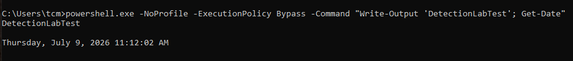

### Detection Query

```spl
index=* source="WinEventLog:Microsoft-Windows-Sysmon/Operational" "<EventID>1</EventID>" "powershell.exe" "ExecutionPolicy Bypass"
```

The search identifies Sysmon Event ID 1 process creation events containing both `powershell.exe` and the suspicious `ExecutionPolicy Bypass` command-line argument.

### Investigation

Relevant fields were extracted from the raw Sysmon XML to provide clearer process context:

```spl
index=* source="WinEventLog:Microsoft-Windows-Sysmon/Operational" "<EventID>1</EventID>" "powershell.exe" "ExecutionPolicy Bypass"
| rex field=_raw "<Data Name='Image'>(?<Image>[^<]+)"
| rex field=_raw "<Data Name='CommandLine'>(?<CommandLine>[^<]+)"
| rex field=_raw "<Data Name='User'>(?<User>[^<]+)"
| rex field=_raw "<Data Name='IntegrityLevel'>(?<IntegrityLevel>[^<]+)"
| rex field=_raw "<Data Name='ParentImage'>(?<ParentImage>[^<]+)"
| table _time User Image CommandLine ParentImage IntegrityLevel
```

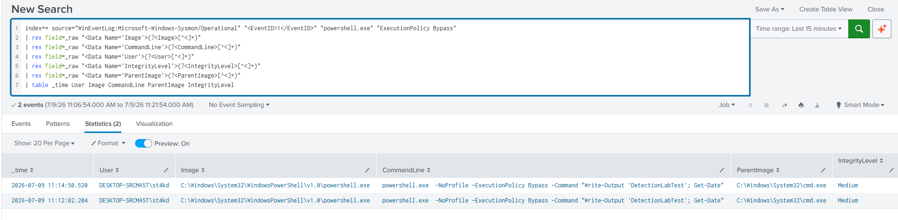

### Findings

The investigation confirmed:

- `powershell.exe` was launched with `-NoProfile` and `-ExecutionPolicy Bypass`
- The full command line was captured by Sysmon
- The process was executed by `st4kd`
- The parent process was `cmd.exe`
- The process ran at `Medium` integrity
- Two matching events were identified because the test command was intentionally executed twice

The observed process relationship was:

```text
cmd.exe
└── powershell.exe -NoProfile -ExecutionPolicy Bypass ...
```

This demonstrates how Sysmon process creation telemetry can be used to identify suspicious PowerShell execution and investigate the surrounding user, command-line, parent-process, and integrity-level context.

## Detection #4 — Suspicious Certutil LOLBin Execution

### Objective

Detect suspicious use of `certutil.exe` using Sysmon Event ID 1 process creation telemetry. The detection focuses on the `-encode` argument, which demonstrates how a legitimate Windows utility can be used in activity that warrants further investigation.

### Test Activity

A safe `certutil.exe` command was executed from a standard Command Prompt:

```cmd
certutil.exe -encode C:\Windows\System32\drivers\etc\hosts "%TEMP%\hosts.b64"
```

The command safely Base64-encoded the local Windows `hosts` file and wrote the result to the user's temporary directory.

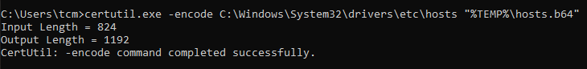

### Detection Query

```spl
index=* source="WinEventLog:Microsoft-Windows-Sysmon/Operational" "<EventID>1</EventID>" "certutil.exe" "-encode"
```

The search identifies Sysmon Event ID 1 process creation events containing both `certutil.exe` and the `-encode` argument.

### Investigation

Relevant fields were extracted from the raw Sysmon XML to provide clearer process context:

```spl
index=* source="WinEventLog:Microsoft-Windows-Sysmon/Operational" "<EventID>1</EventID>" "certutil.exe" "-encode"
| rex field=_raw "<Data Name='Image'>(?<Image>[^<]+)"
| rex field=_raw "<Data Name='CommandLine'>(?<CommandLine>[^<]+)"
| rex field=_raw "<Data Name='User'>(?<User>[^<]+)"
| rex field=_raw "<Data Name='IntegrityLevel'>(?<IntegrityLevel>[^<]+)"
| rex field=_raw "<Data Name='ParentImage'>(?<ParentImage>[^<]+)"
| table _time User Image CommandLine ParentImage IntegrityLevel
```

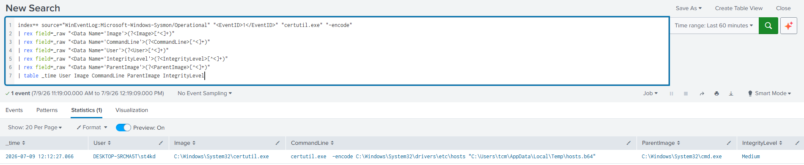

### Findings

The investigation confirmed:

- `certutil.exe` was launched with the `-encode` argument
- The complete command line was captured by Sysmon
- The process was executed by `st4kd`
- The parent process was `cmd.exe`
- The process ran at `Medium` integrity
- One matching process creation event was identified

The observed process relationship was:

```text
cmd.exe
└── certutil.exe -encode ...
```

This demonstrates how Sysmon process creation telemetry can be used to identify potentially suspicious use of legitimate Windows utilities and investigate the associated command line, user, parent process, and execution context.
